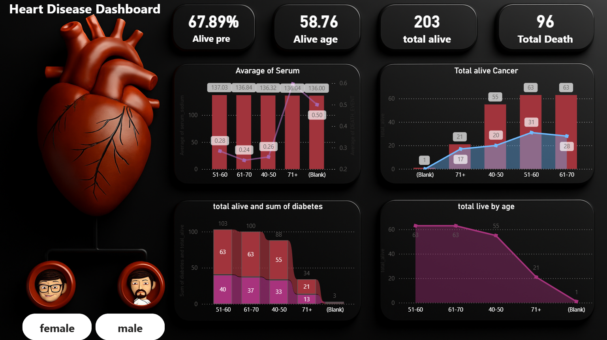

# ❤️ Heart Disease Analysis Dashboard

## 📊 Project Overview

This project presents an interactive **Heart Disease Analysis Dashboard** built using **Microsoft Power BI**. The dashboard analyzes clinical records of heart disease patients and provides insights into patient survival, age distribution, diabetes, cancer, serum sodium levels, and other important health indicators.

The objective of this project is to transform raw healthcare data into meaningful visual insights that can help understand patterns related to **patient survival and mortality**.

---

## 🎯 Project Objectives

The main objectives of this project are:

* Analyze the overall survival and death rate of heart disease patients.
* Understand how patient age is related to survival.
* Analyze the relationship between diabetes and patient survival.
* Compare cancer-related cases across different age groups.
* Study serum sodium levels across patient age categories.
* Create an interactive and visually appealing Power BI dashboard.

---

## 📌 Key Performance Indicators (KPIs)

The dashboard highlights the following key metrics:

| KPI                           |       Value |
| ----------------------------- | ----------: |
| Total Patients                |         299 |
| Total Alive Patients          |         203 |
| Total Deaths                  |          96 |
| Alive Percentage              |      67.89% |
| Average Age of Alive Patients | 58.76 Years |

---

## 📈 Dashboard Visualizations

### 1. Alive Percentage

Displays the percentage of patients who survived.

**Alive Percentage: 67.89%**

This provides a quick overview of the overall survival rate.

---

### 2. Average Age of Alive Patients

Displays the average age of patients who are currently alive.

**Average Age: 58.76 Years**

---

### 3. Total Alive vs Total Death

Compares the total number of surviving and deceased patients.

* 🟢 **Total Alive:** 203
* 🔴 **Total Death:** 96

---

### 4. Average Serum Sodium by Age Group

This visualization analyzes the average **serum sodium level** across different age groups.

Age groups include:

* 40–50
* 51–60
* 61–70
* 71+
* Blank / Other

The chart also compares serum sodium with another health-related measure to identify possible patterns across age categories.

---

### 5. Total Alive and Cancer Analysis

This chart compares:

* Total alive patients
* Cancer-related cases

across different age groups.

This helps identify how cancer cases and survival numbers vary with age.

---

### 6. Total Alive by Age

A line and area chart is used to visualize the number of surviving patients across age categories.

This helps identify the age groups with the highest number of surviving patients.

---

### 7. Gender Analysis

The dashboard includes gender-based filtering using:

* 👩 Female
* 👨 Male

Users can interact with these filters to analyze the data based on gender.

---

## 📂 Dataset Information

The dataset contains **299 clinical records** and includes the following features:

| Column                | Description                                              |
| --------------------- | -------------------------------------------------------- |
| `count`               | Record identifier                                        |
| `age`                 | Age of the patient                                       |
| `Hypertensions`       | Hypertension indicator                                   |
| `muscle_damage_scale` | Indicator related to muscle/heart damage                 |
| `diabetes`            | Whether the patient has diabetes                         |
| `ejection_fraction`   | Percentage of blood leaving the heart during contraction |
| `high_blood_pressure` | Indicates whether the patient has high blood pressure    |
| `platelets`           | Platelet count                                           |
| `kidney_marker`       | Kidney-related health indicator                          |
| `serum_sodium`        | Serum sodium level in the blood                          |
| `sex`                 | Gender of the patient                                    |
| `cancer`              | Cancer-related indicator                                 |
| `time`                | Follow-up period                                         |
| `DEATH_EVENT`         | Patient survival status                                  |

---

## 🛠️ Tools and Technologies Used

* **Microsoft Power BI**
* **Microsoft Excel**
* **Power Query**
* **DAX**
* **Data Cleaning**
* **Data Visualization**
* **Data Analysis**

---

## 🔄 Data Analysis Process

The following steps were performed during the project:

### 1. Data Collection

The heart disease clinical dataset was imported from an Excel file into Power BI.

### 2. Data Cleaning

The dataset was reviewed and prepared for analysis.

The process included:

* Checking column names
* Reviewing data types
* Handling blank or missing values
* Verifying numerical and categorical fields
* Preparing the data for visualization

### 3. Data Transformation

Age-based categories were created to make the analysis easier.

Examples include:

* 40–50
* 51–60
* 61–70
* 71+

### 4. KPI Creation

Key metrics were calculated using Power BI measures, including:

* Total Alive Patients
* Total Deaths
* Alive Percentage
* Average Age of Alive Patients

### 5. Dashboard Development

Different Power BI visuals were used to present insights in an easy-to-understand format.

---

## 💡 Key Insights

Based on the dashboard analysis:

* Out of **299 patients**, **203 patients survived**.
* **96 patients experienced a death event**.
* The overall survival rate is approximately **67.89%**.
* The average age of surviving patients is approximately **58.76 years**.
* The **51–60 and 61–70 age groups** contain a large proportion of surviving patients.
* Health indicators such as **diabetes, cancer, serum sodium, hypertension, and gender** can be explored to understand their relationship with patient outcomes.

---

## 📸 Dashboard Preview

Add your dashboard screenshot to the repository and display it here.

```text
Heart_Disease_Dashboard.png
```




---

## 📁 Project Structure

```text
Heart-Disease-Dashboard/
│
├── heart_project.pbix
├── Heart_Disease_Dataset.xlsx
├── Heart_Disease_Dashboard.png
└── README.md
```

---

## 🚀 How to Use This Project

1. Clone this repository.

```bash
git clone <your-repository-link>
```

2. Open the project folder.

3. Open the `.pbix` file using **Microsoft Power BI Desktop**.

4. Explore the interactive dashboard.

5. Use the gender filters and other available interactions to analyze the patient data.

---

## 📊 Skills Demonstrated

This project demonstrates the following Data Analyst skills:

* Data Cleaning
* Data Transformation
* Data Analysis
* KPI Development
* DAX Calculations
* Power BI Dashboard Development
* Data Visualization
* Healthcare Data Analysis
* Business Insight Generation

---

## 🔮 Future Improvements

Possible future improvements for this project include:

* Adding more interactive slicers.
* Creating a detailed patient demographic analysis.
* Adding survival analysis based on multiple health conditions.
* Creating more advanced DAX measures.
* Adding trend analysis.
* Improving drill-through and tooltip functionality.
* Publishing the dashboard to Power BI Service.

---

## 👤 Author

**Ujju Patel**

Aspiring Data Analyst | Power BI | Excel | Data Analysis

---

## ⭐ Support

If you found this project useful, please consider giving this repository a **star ⭐**.

Thank you for visiting!
